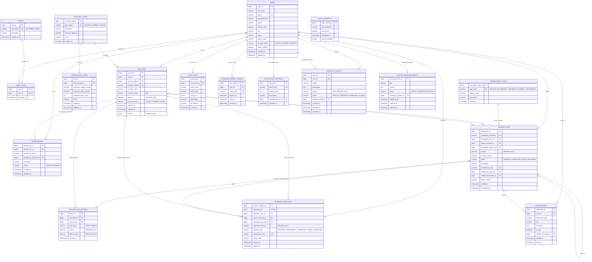

# FinCore Relational Database Entity-Relationship Diagram

```mermaid
erDiagram
    ROLES ||--o{ USER_ROLES : "assigned to"
    USERS ||--o{ USER_ROLES : "possesses"
    USERS ||--o{ ACCOUNTS : "owns"
    ACCOUNT_TYPES ||--o{ ACCOUNTS : "classifies"
    ACCOUNT_TYPES ||--o{ TRANSACTION_LIMITS : "governs"
    USERS ||--o{ BENEFICIARIES : "saves"
    ACCOUNTS ||--o{ BENEFICIARIES : "designated as recipient"
    USERS ||--o{ TRANSACTIONS : "initiates"
    TRANSACTION_TYPES ||--o{ TRANSACTIONS : "defines nature"
    ACCOUNTS ||--o{ TRANSACTIONS : "source of funds"
    ACCOUNTS ||--o{ TRANSACTIONS : "destination of funds"
    TRANSACTIONS ||--o{ TRANSACTIONS : "reverses"
    TRANSACTIONS ||--|{ TRANSACTION_ENTRIES : "records double-entry leg"
    ACCOUNTS ||--|{ TRANSACTION_ENTRIES : "impacts balance"
    USERS ||--o{ TRANSFER_REQUESTS : "requests"
    ACCOUNTS ||--o{ TRANSFER_REQUESTS : "source of transfer"
    ACCOUNTS ||--o{ TRANSFER_REQUESTS : "destination of transfer"
    TRANSACTIONS ||--o| TRANSFER_REQUESTS : "fulfills"
    USERS ||--o{ NOTIFICATIONS : "receives"
    TRANSACTIONS ||--o{ NOTIFICATIONS : "triggers"
    USERS ||--o{ AUDIT_LOGS : "acts as actor"
    USERS ||--o{ PASSWORD_RESET_TOKENS : "requests reset"
    USERS ||--o{ APPLICATION_SETTINGS : "last configured by"
    USERS ||--o{ SUPPORT_TICKETS : "submits"
    USERS ||--o{ SUPPORT_TICKETS : "assigned as admin"
    USERS ||--o{ SYSTEM_ANNOUNCEMENTS : "published by admin"

    ROLES {
        bigint role_id PK
        varchar role_name UK "CUSTOMER, ADMIN"
        varchar description
        timestamp created_at
    }

    USERS {
        bigint user_id PK
        varchar full_name
        varchar email UK
        varchar password_hash
        varchar phone
        varchar address_line
        varchar city
        varchar state
        varchar postal_code
        varchar account_status "ACTIVE, BLOCKED, PENDING"
        boolean email_verified
        timestamp created_at
        timestamp updated_at
    }

    USER_ROLES {
        bigint user_id PK, FK
        bigint role_id PK, FK
        timestamp assigned_at
    }

    ACCOUNT_TYPES {
        bigint account_type_id PK
        varchar type_name UK "SAVINGS, CURRENT, SALARY"
        varchar description
        decimal minimum_balance
        boolean active
        timestamp created_at
    }

    ACCOUNTS {
        bigint account_id PK
        bigint user_id FK
        bigint account_type_id FK
        varchar account_number UK
        varchar account_name
        varchar currency_code "INR"
        decimal balance "DECIMAL(19,2)"
        varchar account_status "ACTIVE, FROZEN, CLOSED"
        timestamp opened_at
        timestamp updated_at
        bigint version "Optimistic lock"
    }

    BENEFICIARIES {
        bigint beneficiary_id PK
        bigint owner_user_id FK
        varchar beneficiary_name
        bigint beneficiary_account_id FK
        varchar nickname
        varchar status "ACTIVE, DISABLED"
        timestamp created_at
        timestamp updated_at
    }

    TRANSACTION_TYPES {
        bigint transaction_type_id PK
        varchar type_code UK "DEPOSIT, WITHDRAWAL, TRANSFER, REVERSAL, ADJUSTMENT"
        varchar display_name
        varchar description
        timestamp created_at
    }

    TRANSACTIONS {
        bigint transaction_id PK
        varchar transaction_reference UK
        bigint transaction_type_id FK
        bigint source_account_id FK
        bigint destination_account_id FK
        decimal amount "DECIMAL(19,2)"
        varchar currency_code
        varchar status "PENDING, COMPLETED, FAILED, REVERSED"
        varchar description
        varchar idempotency_key UK
        bigint initiated_by_user_id FK
        bigint related_transaction_id FK
        varchar failure_reason
        timestamp created_at
        timestamp completed_at
    }

    TRANSACTION_ENTRIES {
        bigint entry_id PK
        bigint transaction_id FK
        bigint account_id FK
        varchar entry_type "DEBIT, CREDIT"
        decimal amount "DECIMAL(19,2)"
        decimal balance_after "DECIMAL(19,2)"
        timestamp created_at
    }

    TRANSFER_REQUESTS {
        bigint transfer_request_id PK
        bigint transaction_id FK, UK
        bigint requester_user_id FK
        bigint source_account_id FK
        bigint destination_account_id FK
        decimal requested_amount "DECIMAL(19,2)"
        varchar request_status "INITIATED, PROCESSING, COMPLETED, FAILED, CANCELLED"
        varchar idempotency_key UK
        varchar failure_code
        timestamp created_at
        timestamp updated_at
    }

    TRANSACTION_LIMITS {
        bigint limit_id PK
        bigint account_type_id FK
        decimal maximum_single_transfer
        decimal maximum_daily_transfer
        int maximum_daily_count
        boolean active
        timestamp created_at
        timestamp updated_at
    }

    NOTIFICATIONS {
        bigint notification_id PK
        bigint user_id FK
        varchar notification_type
        varchar title
        text message
        boolean is_read
        bigint related_transaction_id FK
        timestamp created_at
        timestamp read_at
    }

    AUDIT_LOGS {
        bigint audit_log_id PK
        bigint actor_user_id FK
        varchar action_type
        varchar entity_type
        bigint entity_id
        varchar description
        varchar ip_address
        timestamp created_at
    }

    LOGIN_ATTEMPTS {
        bigint login_attempt_id PK
        varchar email_identifier
        boolean successful
        timestamp attempted_at
        varchar source_identifier
    }

    PASSWORD_RESET_TOKENS {
        bigint reset_token_id PK
        bigint user_id FK
        varchar token_hash UK
        timestamp expires_at
        timestamp used_at
        timestamp created_at
    }

    APPLICATION_SETTINGS {
        bigint setting_id PK
        varchar setting_key UK
        text setting_value
        varchar description
        bigint updated_by_user_id FK
        timestamp updated_at
    }

    SUPPORT_TICKETS {
        bigint ticket_id PK
        bigint user_id FK
        varchar subject
        text description
        varchar priority "LOW, MEDIUM, HIGH"
        varchar status "OPEN, IN_PROGRESS, RESOLVED, CLOSED"
        bigint assigned_admin_id FK
        timestamp created_at
        timestamp updated_at
        timestamp resolved_at
    }

    SYSTEM_ANNOUNCEMENTS {
        bigint announcement_id PK
        varchar title
        text content
        varchar status "DRAFT, PUBLISHED, ARCHIVED"
        bigint created_by_admin_id FK
        timestamp published_at
        timestamp created_at
        timestamp updated_at
    }
```
